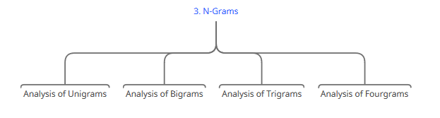
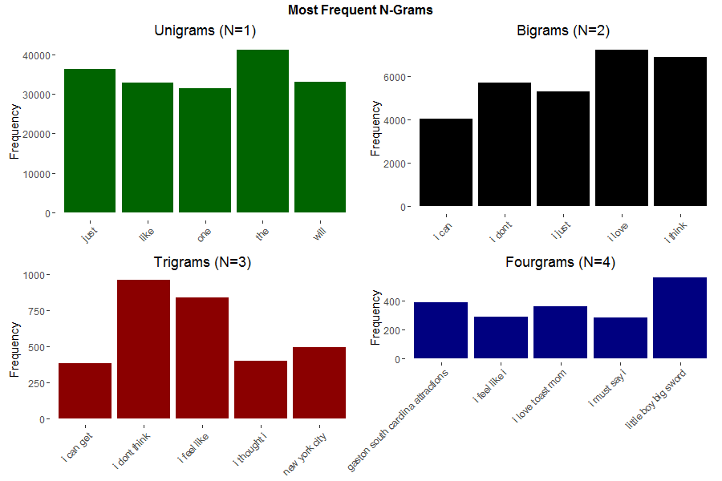

```{r setup, include=FALSE}
knitr::opts_chunk$set(
	echo = TRUE,
	message = FALSE,
	warning = FALSE
)
```
```{r libraries, message=FALSE, warning=FALSE, include=FALSE}
library(knitr)
library(tm)
library(quanteda)
library(SnowballC)
library(ggplot2)
library(gridExtra)
library(reshape2)
library(stringi)
```

### Project Overview
This is the milestone report for the Coursera Data Science Capstone Project, in which we aim to implement an algorithm to predict the next word, given raw text data that needs to be cleaned and analysed.  
The topic of our report is **NLP (Natural Language Processing)**.

----------------------------------------------------------------------------------------

### Our Data
#### Data Loading  

We are required to load three large text files into the `R Workspace`, explore these files and clean them, before we begin with the processing of their content.  


<center></center>

```{r WordLineChar Table, echo=FALSE, message=FALSE, warning=FALSE}
setwd("C://Users//Yanal Kashou//Data Science//Projects//R//DataScienceCapstone//cache")
load("r.df.RData")
kable(r.df)
```

#### Data Sampling and Cleaning

To make it easier for computation, we have to reduce the size of the data to an acceptable value, in this case we will take a random binomial sample of 15% of each dataset to work with, clean, analyze and visualize.  

Outlined below are the pre-processing steps we walked through:

<center></center>

```{r Sampled WordLineChar Table, echo=FALSE, message=FALSE, warning=FALSE}
setwd("C://Users//Yanal Kashou//Data Science//Projects//R//DataScienceCapstone//cache")
load("s.df.RData")
kable(s.df)  
```
```{r plots, message=FALSE, warning=FALSE, include=FALSE}
s.df.long <- melt(s.df)
line.subset <- subset(s.df.long, variable == "Line Count")
```
We used the `tm` package to perform these steps and we left the stemming procedure to be performed automatically as we created a **Document Feature Matrix** using the `quanteda` package for each document in the corpus. This was done because stemming using the `tm` package caused word content to be ruined and require a further process called `stemCompletion`.

```{r, echo=FALSE, message=FALSE, warning=FALSE}
setwd("C://Users//Yanal Kashou//Data Science//Projects//R//DataScienceCapstone//cache")
load("f.df.RData")
kable(f.df)
```

----------------------------------------------------------------------------------------

### N-Grams 
We used `NGramTokenizer` from the `RWeka` package to find the most frequent **unigrams**, **bigrams**, **trigrams** and **fourgrams**; also to produce the values below:

<center></center>  


<center></center>
----------------------------------------------------------------------------------------

### Further Plans

#### Considerations
* The N-Grams frequency model produced is of our random sample of 15% of the dataset. If we performed another random sample, the most frequent words might change.  
* If there is a way to create an N-Gram model of the entire dataset without sampling and without affecting app performance, this would be our best solution for high accuracy. Cannot be confirmed until further testing.  

#### Algorithm

<center></center>

__Machine Learning__  

* Decision Tree logically must be the fastest algorithm to use if we are to grab the most frequent words of (N + 1) Grams. That essentially means that if a person enters a single word (N = 1), then the most probable next word is a Bigram (1 + 1). Subsequently if a person enters 2 words or 3 words, then we know the next word must come from Trigrams or Fourgrams respectively.  

* SVMs are very efficient, accurate but slower than decision trees when implemented.  

* randomForest is a great choice for accuracy, but we must select an optimal number of trees to balance accuracy and computational efficiency.  

__Deep Learning__  

* (ANNs) Artificial Neural Networks present a very different and difficult challange where we must come up with a mathematical model for the algorithm to be implemented. Two great solutions to NLP are (CNNs) Convolutional Neural Netwoks and (RNNs) Recurrent Neural Networks.  

* We might attempt at the implementation of an ANN, however this will be left for later after the machine learning algorithms in the above section have been tested, timed and implemented.  
  
----------------------------------------------------------------------------------------

#### Data Product
  
<center></center>

* Deploy an app using the implemented algorithm to shinyapps.io

----------------------------------------------------------------------------------------
### Source Code
For access to my GitHub Repository associated with this project, please visit the URL below:  
[Data Science Capstone](https://github.com/ykashou92/DataScienceCapstone) 
